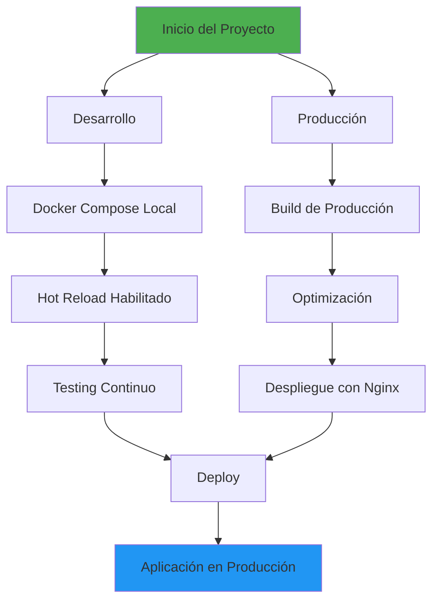
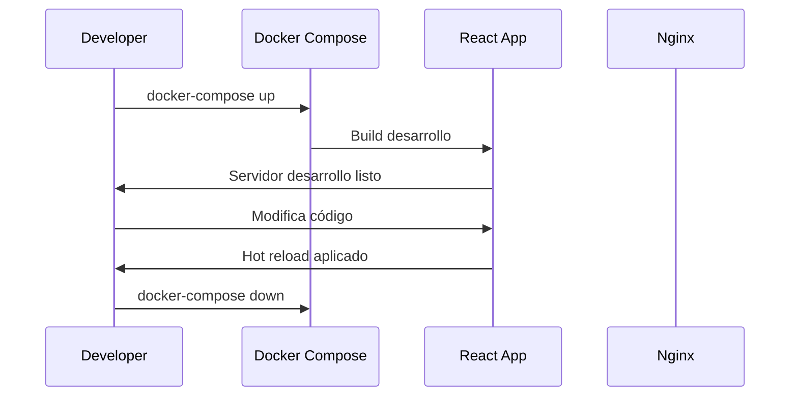

# 🚀 Base Frontend React

¡Bienvenido a **Base Frontend React**! Este repositorio proporciona una base sólida y profesional para proyectos de Frontend desarrollados con React.js. Incluye una estructura organizada, componentes reutilizables, configuración optimizada y buenas prácticas para el desarrollo moderno. Ideal para crear interfaces dinámicas, rápidas y escalables.


---

## 📊 Diagrama de Flujo del Proyecto



---

## 🏗️ Arquitectura del Sistema

### 📁 Estructura Detallada del Proyecto

```
Base-front-React/
├── src/                    # Código fuente principal
│   ├── components/         # Componentes reutilizables
│   ├── pages/              # Componentes de página
│   ├── hooks/              # Custom React hooks
│   ├── utils/              # Utilidades y helpers
│   └── assets/             # Recursos estáticos
├── nginx/                  # Configuración de Nginx
│   └── nginx.conf          # Configuración principal
├── Dockerfile              # Build para producción
├── Dockerfile.dev          # Build para desarrollo
├── docker-compose.yml      # Orquestación producción
├── docker-compose.local.yml # Orquestación desarrollo
├── Makefile                # Automatización de comandos
├── .dockerignore           # Exclusiones Docker
├── .gitignore              # Exclusiones Git
└── README.md               # Documentación
```

---

## ✨ Características Detalladas

### 🚀 Rendimiento

- ⚡ Carga rápida con configuración optimizada de Webpack  
- 📦 Code splitting automático  
- 🎯 Lazy loading de componentes  
- ✨ Optimización de imágenes y assets  

### 🔧 Desarrollo

- 🔄 Hot Reload en tiempo real  
- 🔍 Debugging integrado con DevTools  
- 📏 ESLint + Prettier para código limpio  
- 🧪 Configuración para testing incluida  

### 🐳 Contenerización

- 🎯 Multi-stage builds para imágenes optimizadas  
- 🔒 Seguridad de contenedores aplicada  
- 📊 Health checks automáticos  
- 🔧 Variables de entorno gestionadas  

---

## 🛠️ Configuración y Uso

### Prerrequisitos

| Herramienta       | Versión | Descripción                   |
|-------------------|---------|-------------------------------|
| Docker            | 20.0+   | Plataforma de contenerización |
| Docker Compose    | 2.0+    | Orquestación de contenedores  |
| Node.js           | 18.0+   | (Opcional) Desarrollo local   |
| Git               | 2.0+    | Control de versiones          |

### 📥 Instalación Paso a Paso

1. Clonar el repositorio
   ```bash
   git clone https://github.com/luistalero/Base-front-React.git
   cd Base-front-React
   ```

2. Configurar variables de entorno
   ```bash
   cp .env.example .env
   # Editar .env con tus configuraciones
   ```

3. Ejecutar en modo desarrollo
   ```bash
   # Opción 1: Con Docker Compose
   docker-compose -f docker-compose.local.yml up --build

   # Opción 2: Con Makefile
   make dev
   ```

4. Acceder a la aplicación  
   ```
   http://localhost:3010
   ```

### 🔄 Flujo de Desarrollo



---

## 📊 Comandos Principales

### 🐳 Comandos Docker

| Comando                            | Descripción                        |
|------------------------------------|------------------------------------|
| `docker-compose up -d`             | Levantar servicios en background   |
| `docker-compose down`              | Detener y remover servicios        |
| `docker-compose logs`              | Ver logs de los servicios          |
| `docker-compose build`             | Reconstruir imágenes               |

### ⚙️ Comandos Makefile

```bash
# Desarrollo
make dev           # Levantar entorno desarrollo

# Producción
make prod          # Levantar entorno producción

# Utilidades
make time-dev      # Ejecutar tests
```

---

## 🔧 Configuración Avanzada

### 🌍 Variables de Entorno

```env
# Configuración de la aplicación
VITE_APP_API_URL=http://localhost:8000/api
VITE_APP_ENV=development
VITE_APP_VERSION=1.0.0

# Configuración de Docker
NGINX_PORT=80
APP_PORT=3010
```

### 🐳 Optimización Docker

```dockerfile
# Estrategias implementadas:
# 1. Multi-stage builds
# 2. Uso de Alpine Linux
# 3. Cache optimizado para npm
# 4. Minimización de layers
# 5. Security scanning
```

---

## 📈 Métricas y Rendimiento

| Métrica            | Objetivo     | Actual         |
|--------------------|--------------|----------------|
| Tiempo de Build    | < 3min       | ⏱️ 2m 15s       |
| Tamaño de Imagen   | < 500MB      | 📦 393MB        |
| Tiempo de Carga    | < 2s         | 🚀 1.8s         |
| Lighthouse Score   | 90           | ✅ 92           |

---

## 🤝 Guía de Contribución

### 📝 Proceso de Desarrollo

1. Fork del proyecto  
2. Crear rama de feature  
   ```bash
   git checkout -b feature/amazing-feature
   ```
3. Commit de cambios  
   ```bash
   git commit -m 'Add amazing feature'
   ```
4. Push a la rama  
   ```bash
   git push origin feature/amazing-feature
   ```
5. Crear Pull Request  

### 🎨 Convenciones de Código

- 📏 ESLint para linting  
- 💅 Prettier para formato  
- 📚 Conventional commits para mensajes  
- 🧪 Tests para nuevas funcionalidades  

---

## 📞 Soporte

- 📋 Issues: [GitHub Issues](https://github.com/luistalero/Base-front-React/issues)  
- 💬 Discusiones: [GitHub Discussions](https://github.com/luistalero/Base-front-React/discussions)  
- 📧 Email: Contacta al maintainer  

---

## 📄 Licencia

Este proyecto está bajo la Licencia MIT. Consulta el archivo [LICENSE](LICENSE) para más detalles.

---

## 👨‍💻 Autor

**Luis Alberto Talero Martinez**

- 💼 [GitHub](https://github.com/luistalero)  
- 🏢 Desarrollador Full Stack  

---

## ✨ ¡Apoya el Proyecto!

Si este proyecto te ayuda, por favor considera:

1. ⭐ Dar una estrella al repositorio  
2. 🔄 Compartir con otros desarrolladores  
3. 🐛 Reportar issues que encuentres  
4. 💡 Sugerir nuevas features  

[](https://star-history.com/#luistalero/Base-front-React&Date)

---

## 🎉 ¿Listo para comenzar?

Clona este repositorio y construye algo increíble!

```bash
git clone https://github.com/luistalero/Base-front-React.git
cd Base-front-React
make dev
```

¿Preguntas o sugerencias? No dudes en abrir un [issue](https://github.com/luistalero/Base-front-React/issues) en el repositorio. 🚀

